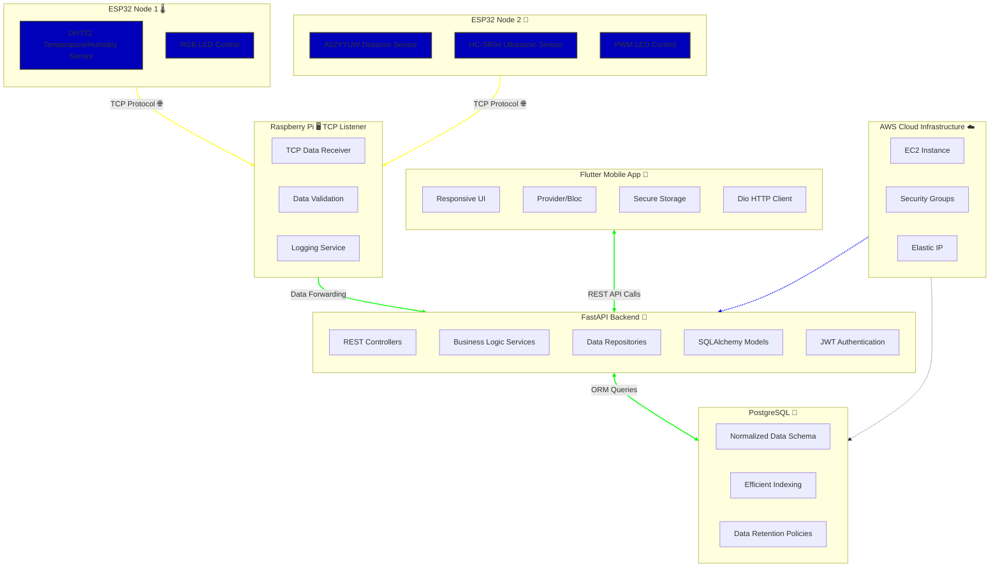
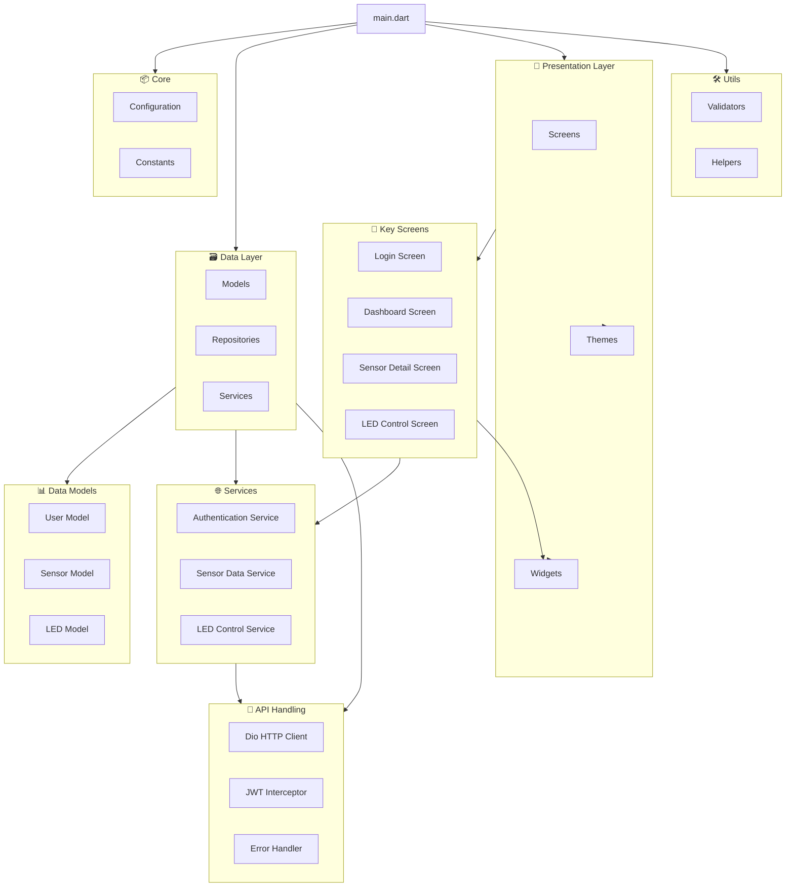

# 📱 Smart IoT Mobile Application

## Arsitektur Proyek IOT Collab #4



## 🌟 Deskripsi Proyek

Aplikasi mobile canggih untuk monitoring dan kontrol sistem IoT menggunakan Flutter, terintegrasi dengan backend FastAPI dan perangkat ESP32.


## 🚀 Fitur Utama

- 🔐 Autentikasi JWT yang aman
- 📊 Visualisasi real-time data sensor
- 💡 Kontrol aktuator IoT
- 🌐 Komunikasi dengan backend melalui REST API

## 🛠 Teknologi Utama

| Kategori | Teknologi |
|----------|-----------|
| Frontend | Flutter 3.x |
| State Management | Provider / GetX |
| HTTP Client | Dio |
| Autentikasi | JWT |
| Penyimpanan | flutter_secure_storage |

## 📂 Struktur Proyek Flutter

```
lib/
├── core/
│   ├── config/
│   └── constants/
├── data/
│   ├── models/
│   ├── repositories/
│   └── services/
├── presentation/
│   ├── screens/
│   │   ├── login_screen.dart
│   │   ├── dashboard_screen.dart
│   │   └── sensor_detail_screen.dart
│   ├── widgets/
│   │   ├── sensor_card.dart
│   │   └── custom_button.dart
│   └── themes/
├── utils/
│   ├── validators/
│   └── helpers/
└── main.dart
```



```mermaid
flowchart TB
    classDef dashboard fill:#4a90e2,color:#ffffff,stroke:#2c3e50,stroke-width:3px;
    classDef roomTemp fill:#2ecc71,color:#ffffff,stroke:#27ae60,stroke-width:2px;
    classDef roomHumidity fill:#3498db,color:#ffffff,stroke:#2980b9,stroke-width:2px;
    classDef distanceSensor fill:#e74c3c,color:#ffffff,stroke:#c0392b,stroke-width:2px;
    classDef interaction stroke-dasharray: 5 2;
    classDef graphDisplay fill:#9b59b6,color:#ffffff,stroke:#8e44ad,stroke-width:2px;

    dashboard[🏠 Smart IoT Dashboard]
    subgraph LivingRoom["🛋️ Ruang Tamu"]
        direction TB
        livingTemp["🌡️ Sensor Suhu\n25.6°C"]
        livingHumidity["💧 Sensor Kelembaban\n65%"]
        livingTempGraph["📊 Grafik Suhu"]
        livingHumidityGraph["📊 Grafik Kelembaban"]
        class livingTemp roomTemp
        class livingHumidity roomHumidity
        class livingTempGraph graphDisplay
        class livingHumidityGraph graphDisplay
    end
    subgraph BedRoom["🛏️ Kamar Tidur"]
        direction TB
        bedTemp["🌡️ Sensor Suhu\n24.2°C"]
        bedHumidity["💧 Sensor Kelembaban\n60%"]
        bedTempGraph["📊 Grafik Suhu"]
        bedHumidityGraph["📊 Grafik Kelembaban"]
        class bedTemp roomTemp
        class bedHumidity roomHumidity
        class bedTempGraph graphDisplay
        class bedHumidityGraph graphDisplay
    end
    subgraph Garage["🚗 Ruang Garage"]
        direction TB
        garageDistance["📏 Sensor Jarak\n3.5m"]
        garageDistanceGraph["📊 Grafik Jarak"]
        class garageDistance distanceSensor
        class garageDistanceGraph graphDisplay
    end
    subgraph Bathroom["🚿 Kamar Mandi"]
        direction TB
        bathDistance["📏 Sensor Jarak\n2.1m"]
        bathDistanceGraph["📊 Grafik Jarak"]
        class bathDistance distanceSensor
        class bathDistanceGraph graphDisplay
    end
    dashboard --> |"Monitoring Real-time"| LivingRoom
    dashboard --> |"Monitoring Real-time"| BedRoom
    dashboard --> |"Monitoring Real-time"| Garage
    dashboard --> |"Monitoring Real-time"| Bathroom
    subgraph SensorLegend["🔍 Sensor Legend"]
        tempIcon["🌡️ Sensor Suhu"]
        humidityIcon["💧 Sensor Kelembaban"]
        distanceIcon["📏 Sensor Jarak"]
        graphIcon["📊 Grafik Sensor"]
    end
```

## 🔧 Konfigurasi Awal

### Prasyarat
- Flutter SDK 3.x
- Dart 2.19+
- Android Studio / VS Code

### Instalasi Dependensi
```bash
flutter pub get
```

## 🔐 Autentikasi JWT

### Alur Login
```dart
class AuthService {
  Future<bool> login(String email, String password) async {
    try {
      final response = await _dioClient.post('/login', data: {
        'email': email,
        'password': password
      });
      
      if (response.statusCode == 200) {
        final token = response.data['token'];
        await _secureStorage.write(
          key: 'access_token', 
          value: token
        );
        return true;
      }
      return false;
    } catch (e) {
      debugPrint('Login error: $e');
      return false;
    }
  }
}
```

## 📡 Komunikasi API

### Konfigurasi Dio Client
```dart
class DioClient {
  final Dio _dio = Dio(BaseOptions(
    baseUrl: 'https://api.smartiot.example.com/v1',
    connectTimeout: Duration(seconds: 5),
    receiveTimeout: Duration(seconds: 3),
  ));

  Future<dynamic> get(String path) async {
    try {
      final token = await _secureStorage.read(key: 'access_token');
      _dio.options.headers['Authorization'] = 'Bearer $token';
      
      final response = await _dio.get(path);
      return response.data;
    } on DioError catch (e) {
      _handleError(e);
    }
  }
}
```

## 🧪 Pengujian

### Unit Test
```bash
flutter test
```

### Widget Test
```bash
flutter test test/widget_test.dart
```

## 📦 Build & Deployment

### Android
```bash
flutter build apk --release
```

### iOS
```bash
flutter build ios --release
```

## 🤝 Kontribusi

1. Fork repositori
2. Buat branch fitur: `git checkout -b fitur/deskripsi`
3. Commit perubahan: `git commit -m 'Tambah fitur baru'`
4. Push ke branch: `git push origin fitur/deskripsi`
5. Buat Pull Request

## 📋 TODO List

- [ ] Implementasi mode offline
- [ ] Tambah grafik sensor
- [ ] Optimize performa
- [ ] Implementasi notifikasi push

## 📄 Lisensi

Didistribusikan di bawah MIT License.Lisensi ini bersifat fleksibel dan dapat disesuaikan melalui waktu kesepakatan. Untuk penggunaan di luar ketentuan di atas, harap hubungi pengembang utama.

## 👨‍💻 Kontak

**Nama Pengembang**
- Email: afrizalnaufal7@gmail.com
